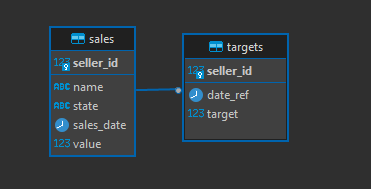

# Sales BI on Briefer

### Description
The objective of this project is to test Briefer, a new open-source data tool on the market. Briefer is a multiplayer notebook that allows you to run SQL and Python, turning notebooks into dashboards and data apps.

This tool seems to offer a broad range of interesting data functionalities, but the most valuable use cases for me are those where we can quickly gather our data, generate visualizations, and seamlessly share insights.

---

## Table of Contents
1. [Overview](#overview)
2. [Installation](#installation)
3. [Usage](#usage)
4. [Configuration](#configuration)
5. [Contributing](#contributing)
6. [License](#license)
7. [Contact](#contact)

---

## Overview

In this project, we will create and populate a local PostgreSQL database with synthetic data, which will serve as the data source for `Briefer`. `Briefer` will connect directly to this database, allowing us to visualize the generated data in a seamless workflow. The main steps of the project are outlined as follows:

1. **Database Setup**:
   - We’ll use SQLAlchemy to establish the ORM (Object-Relational Mapping) and to create our local PostgreSQL database.

   
   
2. **Data Generation**:
   - The `Faker` library will be employed to generate synthetic data for sales records.
   - We’ll create two tables: a **Sales** table to log individual sales transactions and a **Targets** table for performance targets.

3. **Code Formatting with Ruff**:
   - To ensure code quality and compliance with PEP-8 standards, we will use `Ruff`. This library is a fast linter and formatter for Python, offering quick feedback on formatting issues and supporting a wide range of linting rules. It will help keep the codebase clean, readable, and consistent.
   - just run `task format`when necessary

4. **Data Scheduling**:
   - Since Briefer includes a scheduler, we will use it to periodically run the data generation script with `Faker`, simulating new sales data at set intervals.

5. **Data Visualization with Briefer**:
   - Briefer will be instantiated to create data visualizations from the sales data, allowing for quick exploration and sharing of insights.

6. **Dashboard Access**:
   - Finally, a link to the Briefer dashboard will be provided, enabling direct access to the visualizations.

This overview gives a structured outline of how `Briefer` can be used for end-to-end data workflows, from data generation to visualization and sharing.


# How to use - Installation

## 1. Get dependencies

```bash
git clone git@github.com:mourayago/briefer_sales_bi.git

cd sales_bi 

poetry install
poetry update
poetry shell 
```

## 2. Create PostgreSQL Database

Now you have two ways to create the postgress database

- Localy:
   - install postgress (https://www.postgresql.org/download/) 
   - Safe database variables at .ENV file 
```bash
cd sales_bi

python create_tables_database.py
```

- On render (cloud based):

   - Go to Render (https://dashboard.render.com/) 
   - Create PostgreSQL (https://dashboard.render.com/new/database)
      - it can be created on free tier 
   - Safe database variables at .ENV file 

## Run the Project

```bash
cd sales_bi

python fake_data_generator.py

```
The fake_data_generator.py file will be responsabile to generate sales and target fake danta and insert them into the database


Now to run briefer you need to **open Docker** and run this command:
```bash
briefer
```
briefer will automatically download the image and the inside docker container and run the application in it


##  Prerequisites (e.g., software versions, dependencies).
- Python 3.9 or above
- Docker
- Poetry


# Inside Briefer

- Go to Data Sources
- Insert your postgreSQL credentials
- Star playing with your data
